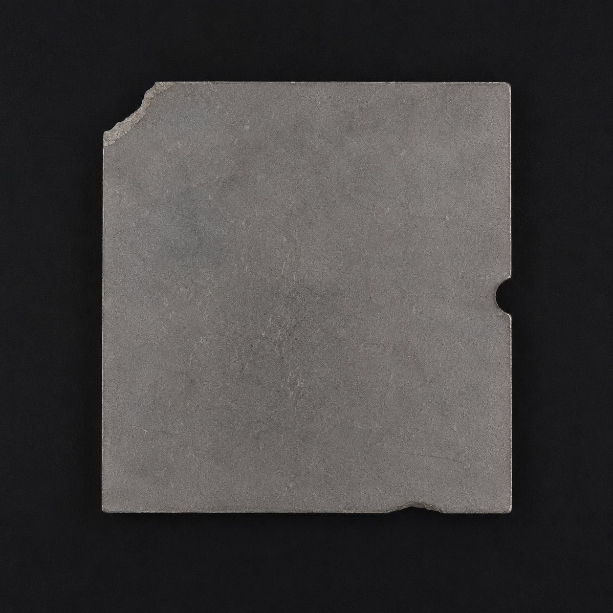
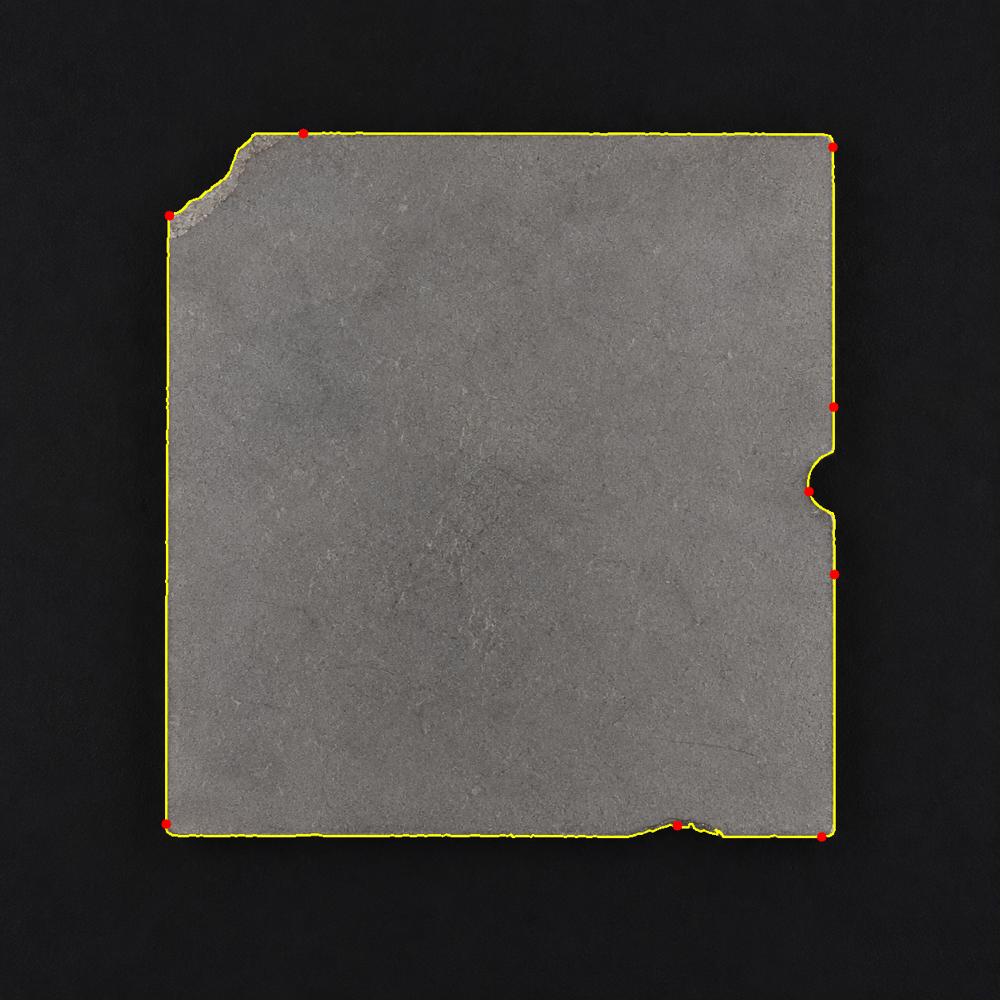
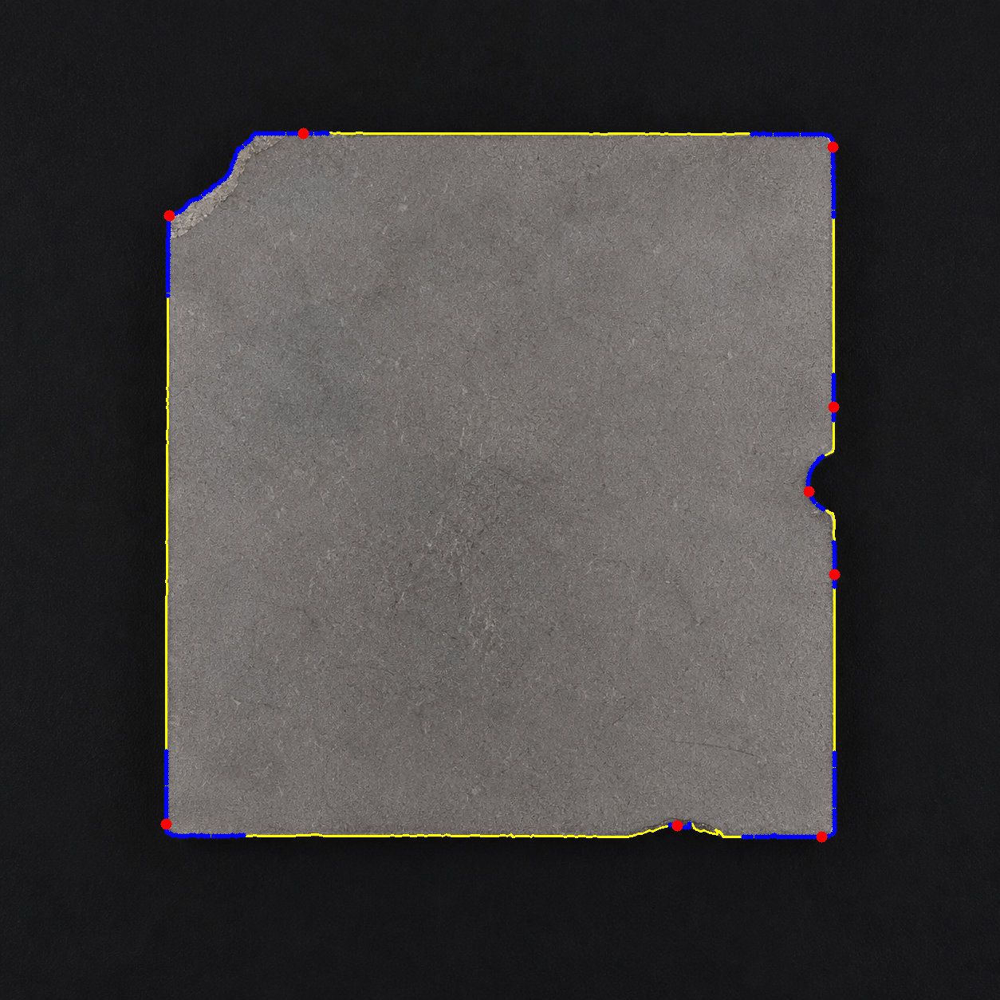
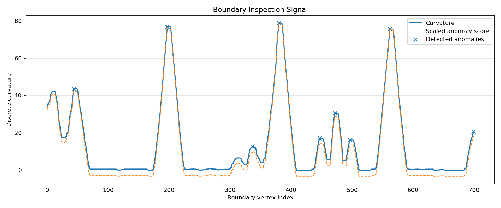

# CurvInspect

<p align="center">
  <b>Discrete Curvature and Boundary Geometry Inspection for Polygonal Curves</b>
</p>

<p align="center">
  <a href="https://github.com/sobhan026/curvinspect">
    
  </a>
  
  
  
  
</p>

---

## Overview

**CurvInspect** is a modular Python toolkit for analyzing object boundaries as **closed polygonal curves**.

It uses ideas from **differential geometry**, **discrete geometry**, and **computer vision** to detect geometric irregularity candidates along digital contours. The main mathematical object of the project is a planar boundary curve extracted from an image. CurvInspect converts that boundary into a uniformly sampled polygonal curve, computes discrete curvature and related geometric inspection signals, groups abnormal responses, and exports visual and JSON reports.

CurvInspect is designed as a practical bridge between:

- Differential Geometry
- Discrete Curvature
- Polygonal Curves
- Digital Geometry
- Computer Vision
- Boundary-Based Shape Inspection

CurvInspect is not a black-box machine-learning system. It is a geometry-driven inspection pipeline.

---

## Motivation

Many real-world boundary defects appear as local geometric irregularities:

- chipped edges,
- broken corners,
- dents,
- notches,
- local inward or outward deviations,
- unexpected sharp changes in boundary direction.

A natural way to analyze these phenomena is to treat the object boundary as a **closed curve**.

In smooth differential geometry, curvature measures how quickly the tangent direction changes along a curve. In digital images, however, boundaries are not smooth curves. They are sampled as pixels or contour points. CurvInspect addresses this by replacing the smooth curve with a **polygonal curve** and using discrete geometric approximations.

---

## Core Idea

Given an input image, CurvInspect follows this pipeline:

```text
Input image
    ↓
Preprocessing and contour extraction
    ↓
Closed polygonal boundary representation
    ↓
Uniform resampling by arc length
    ↓
Geometric inspection signal computation
    ↓
Robust anomaly detection
    ↓
Grouping and representative peak extraction
    ↓
Overlay, debug overlay, signal plot, and JSON report
```

The output is not a final semantic judgment. Instead, CurvInspect identifies **geometric irregularity candidates** that may require interpretation depending on the application.

---

## Visual Example

The following example uses the chord-based industrial inspection preset.

```bash
curvinspect analyze examples/input/real/object_04.png \
  --output examples/output/real/object_04_chord_tuned_1 \
  --method threshold \
  --analysis-contour raw \
  --inspection-signal chord \
  --chord-mode absolute \
  --chord-step 25 \
  --num-samples 700 \
  --smoothing median \
  --smoothing-window 11 \
  --threshold 1.9
```

Recommended README assets:

```text
docs/assets/object_04_input.png
docs/assets/object_04_overlay.png
docs/assets/object_04_overlay_debug.png
docs/assets/object_04_signal.png
```

### Input Image



### Final Overlay

The final overlay shows the representative anomaly regions selected after grouping raw anomalous boundary samples.



### Debug Overlay

The debug overlay is useful for inspecting the detection process:

- small blue points: raw anomalous boundary samples,
- larger red points: representative peak points after grouping,
- yellow curve: analyzed boundary contour.



### Inspection Signal

The signal plot shows the processed geometric inspection signal and the selected anomaly peaks.



---

## Mathematical Foundation

Let a closed polygonal curve be represented by vertices

$$
p_0, p_1, \dots, p_{n-1} \in \mathbb{R}^2.
$$

At each vertex, CurvInspect estimates a signed turning angle from the incoming and outgoing edge directions.

For consecutive unit tangents \(T_{i-1}\) and \(T_i\), the signed turning angle is computed using

$$
\theta_i =
\operatorname{atan2}
\left(
\det(T_{i-1}, T_i),
T_{i-1}\cdot T_i
\right).
$$

A discrete curvature value is then approximated as

$$
\kappa_i \approx \frac{\theta_i}{\Delta s_i},
$$

where

$$
\Delta s_i =
\frac{\|e_{i-1}\|+\|e_i\|}{2}.
$$

Here:

- \(\theta_i\) is the signed turning angle,
- \(\Delta s_i\) is the local arc-length scale,
- \(\kappa_i\) is the discrete curvature at vertex \(i\).

This allows curvature-like information to be computed directly on digital contours.

---

## Inspection Signals

CurvInspect supports multiple geometry-based inspection signals. This is important because different boundary defects create different geometric patterns.

### 1. Curvature Signal

The curvature signal detects strong changes in tangent direction.

Best suited for:

- sharp corners,
- notches,
- strong turning events,
- highly localized angular irregularities.

Available curvature modes:

```text
signed
absolute
positive
negative
convex
concave
```

### 2. Smoothed Normal Deviation

The contour is compared against a smoothed reference version of itself. The displacement is projected along local normal directions.

This is useful for identifying boundary regions that deviate from the general local shape.

Available deviation modes:

```text
signed
absolute
positive
negative
```

### 3. Local Chord Deviation

For each point \(p_i\), CurvInspect compares the point against the chord connecting two wider-neighborhood points:

$$
p_{i-k}
\quad \text{and} \quad
p_{i+k}.
$$

The perpendicular distance from \(p_i\) to this local chord forms a scale-dependent boundary irregularity signal.

This is useful for:

- shallow chips,
- local edge damage,
- subtle defects on nearly straight boundaries,
- deviations that do not produce a very strong curvature peak.

A useful geometric intuition is that, for a smooth curve over a short chord length, sagitta-like deviation is related to curvature. This keeps the method within the language of curve geometry rather than moving into unrelated image-processing heuristics.

### 4. Combined Signal

The combined mode merges normalized curvature, smoothed deviation, and chord deviation responses. It is useful when a boundary may contain multiple types of irregularities.

---

## Features

- Extract main object contour from an image
- Represent image boundaries as closed polygonal curves
- Uniformly resample contours by arc length
- Compute signed discrete turning angles
- Estimate discrete curvature
- Compute total curvature and bending energy
- Detect convex or concave curvature behavior
- Compute smoothed normal deviation
- Compute local chord deviation
- Combine multiple geometric inspection signals
- Detect anomalies using robust z-scores
- Group raw anomaly points into representative regions
- Export final overlay images
- Export debug overlays showing raw and peak anomaly points
- Export signal plots
- Export JSON reports
- Generate synthetic demo images
- Use named CLI presets as configurable starting points
- Override any preset parameter manually
- Fully modular codebase
- Test suite using `pytest`
- Linting with `ruff`

---

## Installation

### 1. Clone the Repository

```bash
git clone https://github.com/sobhan026/curvinspect.git
cd curvinspect
```

### 2. Create a Virtual Environment

Using `uv`:

```bash
uv venv
```

Activate the environment on Windows PowerShell:

```powershell
.venv\Scripts\Activate.ps1
```

### 3. Install the Project

```bash
uv pip install -e ".[dev]"
```

### 4. Verify Installation

```bash
python -c "import curvinspect; print(curvinspect.__version__)"
```

---

## Quick Start

### Run the Built-In Demo

```bash
curvinspect demo
```

This generates synthetic input images and analyzes a normal and defective part.

Expected outputs include:

```text
examples/output/demo/normal/overlay.png
examples/output/demo/normal/overlay_debug.png
examples/output/demo/normal/curvature_signal.png
examples/output/demo/normal/anomaly_report.json

examples/output/demo/defective/overlay.png
examples/output/demo/defective/overlay_debug.png
examples/output/demo/defective/curvature_signal.png
examples/output/demo/defective/anomaly_report.json

examples/output/demo/demo_summary.json
```

---

## Analyze a Custom Image

```bash
curvinspect analyze path/to/image.png --output examples/output/run_01
```

Example:

```bash
curvinspect analyze examples/input/real/object_04.png \
  --output examples/output/real/object_04_chord_tuned_1 \
  --method threshold \
  --analysis-contour raw \
  --inspection-signal chord \
  --chord-mode absolute \
  --chord-step 25 \
  --num-samples 700 \
  --smoothing median \
  --smoothing-window 11 \
  --threshold 1.9
```

---

## CLI Presets

CurvInspect includes named presets. A preset is only a **starting configuration**.  
Any option can still be overridden manually.

For example:

```bash
curvinspect analyze image.png --preset industrial-chord
```

Manual override:

```bash
curvinspect analyze image.png --preset industrial-chord --chord-step 35 --threshold 2.2
```

### Available Presets

| Preset | Purpose |
|---|---|
| `general-curvature` | General curvature-based boundary inspection |
| `smooth-shape` | Smooth objects such as caps, circular objects, or rounded parts |
| `clean-simplified` | Cleaner output using simplified contours |
| `concave-notch` | Detecting inward notches or concave boundary regions |
| `industrial-chord` | Sensitive chord-based inspection for industrial parts |
| `industrial-chord-strict` | Cleaner and stricter chord-based inspection |
| `sensitive-chord` | More sensitive local chord inspection |
| `industrial-combined` | Combined curvature, deviation, and chord signal |

---

## Important CLI Options

```text
--preset
--method {threshold,canny}
--analysis-contour {raw,simplified}
--inspection-signal {curvature,deviation,chord,combined}
--curvature-mode {signed,absolute,positive,negative,convex,concave}
--deviation-mode {signed,absolute,positive,negative}
--deviation-window
--chord-mode {signed,absolute,positive,negative}
--chord-step
--num-samples
--smoothing {none,median,moving_average}
--smoothing-window
--threshold
--epsilon-ratio
--min-area
--invert
```

---

## Output Files

Each analysis run produces the following files.

### `overlay.png`

Final overlay showing representative anomaly regions.

### `overlay_debug.png`

Debug overlay showing:

- raw anomalous points,
- representative peak points,
- analyzed contour.

This is useful for understanding whether a region was missed by detection or only missed by peak selection.

### `curvature_signal.png`

Signal plot showing the processed inspection signal and anomaly markers.

The file name is kept as `curvature_signal.png` for backward compatibility, but depending on the selected mode, the plotted signal may be curvature, deviation, chord deviation, or a combined signal.

### `anomaly_report.json`

Structured JSON report containing:

- input metadata,
- contour measurements,
- curvature statistics,
- inspection settings,
- anomaly indices,
- grouped anomaly regions,
- output file paths.

---

## Example: Industrial Chord Inspection

A practical setting for local edge defects is:

```bash
curvinspect analyze examples/input/real/object_04.png \
  --output examples/output/real/object_04_chord_tuned_1 \
  --method threshold \
  --analysis-contour raw \
  --inspection-signal chord \
  --chord-mode absolute \
  --chord-step 25 \
  --num-samples 700 \
  --smoothing median \
  --smoothing-window 11 \
  --threshold 1.9
```

This configuration uses a chord-based local boundary inspection strategy:

```text
analysis_contour = raw
inspection_signal = chord
chord_mode = absolute
chord_step = 25
num_samples = 700
smoothing = median
smoothing_window = 11
threshold = 1.9
```

This setup is useful when shallow local edge defects should be detected without relying only on high curvature peaks.

---

## Raw vs Simplified Contours

CurvInspect supports two contour representations.

### Raw Contour

```text
--analysis-contour raw
```

Advantages:

- preserves small local boundary defects,
- better for shallow chips or subtle irregularities.

Disadvantages:

- more sensitive to noise,
- may require stronger smoothing or stricter thresholds.

### Simplified Contour

```text
--analysis-contour simplified
```

Advantages:

- cleaner and more stable,
- useful for high-level shape analysis.

Disadvantages:

- may remove shallow or small defects.

This trade-off is one of the key practical findings of the project.

---

## Why Not Only Curvature?

Discrete curvature is powerful, but it is not enough for every kind of defect.

A sharp notch usually produces a strong curvature peak.  
A shallow chip on a nearly straight edge may not.

For this reason, CurvInspect includes complementary curve-based signals:

```text
curvature
deviation
chord
combined
```

This preserves the differential geometry foundation while making the project more robust on real digital contours.

---

## Tests and Quality Checks

Run the test suite:

```bash
pytest
```

Run lint checks:

```bash
ruff check src tests
```

Expected current status:

```text
48 passed
All checks passed
```

---

## Project Structure

```text
curvinspect/
│   README.md
│   pyproject.toml
│   requirements.txt
│   LICENSE
│
├── .github/
│   └── workflows/
│       └── tests.yml
│
├── docs/
│   ├── algorithm.md
│   ├── math_background.md
│   ├── use_cases.md
│   └── assets/
│       ├── object_04_input.png
│       ├── object_04_overlay.png
│       ├── object_04_overlay_debug.png
│       └── object_04_signal.png
│
├── examples/
│   ├── input/
│   └── output/
│
├── notebooks/
│   └── demo_curvature_defect_detection.ipynb
│
├── src/
│   └── curvinspect/
│       ├── anomaly.py
│       ├── cli.py
│       ├── contour.py
│       ├── curvature.py
│       ├── deviation.py
│       ├── demo.py
│       ├── image_io.py
│       ├── pipeline.py
│       ├── preprocessing.py
│       ├── report.py
│       ├── resampling.py
│       ├── smoothing.py
│       ├── synthetic.py
│       ├── visualization.py
│       └── __init__.py
│
└── tests/
    ├── test_anomaly_detection.py
    ├── test_cli.py
    ├── test_contour.py
    ├── test_curvature_circle.py
    ├── test_deviation.py
    ├── test_pipeline.py
    ├── test_preprocessing.py
    ├── test_report.py
    ├── test_resampling.py
    ├── test_smoothing.py
    ├── test_synthetic.py
    └── test_turning_angle.py
```

---

## Educational Value

CurvInspect is especially suitable for a Differential Geometry or Discrete Geometry presentation because it demonstrates how smooth geometric concepts can be translated into computational form.

The project shows:

- how smooth curvature becomes discrete turning angle,
- how curves become polygonal contours,
- how arc length becomes discrete edge length,
- how local curve behavior can be inspected through scale-dependent signals,
- how mathematical geometry can be used in practical digital applications.

---

## Limitations

CurvInspect detects **geometric irregularity candidates**, not guaranteed semantic defects.

A detected region may be:

- a true defect,
- a designed corner,
- a natural shape feature,
- noise from segmentation,
- or an artifact of contour extraction.

For industrial-grade inspection, CurvInspect should be combined with:

- controlled imaging,
- calibrated segmentation,
- nominal reference shapes,
- domain-specific thresholds,
- and validation datasets.

This project is best understood as a geometry-driven prototype and educational toolkit.

---

## Roadmap

Possible future extensions:

- JSON configuration files for reusable inspection settings
- multi-scale chord deviation
- better anomaly grouping strategies
- reference-shape comparison
- benchmark image datasets
- interactive notebooks
- web-based visualization
- optional GUI
- more advanced contour smoothing strategies

---

## License

This project is released under the MIT License.

---

## Author

Developed by [Sobhan Ebrahimi](https://github.com/sobhan026) as a modular discrete-geometry project focused on polygonal curvature analysis and boundary irregularity inspection.
